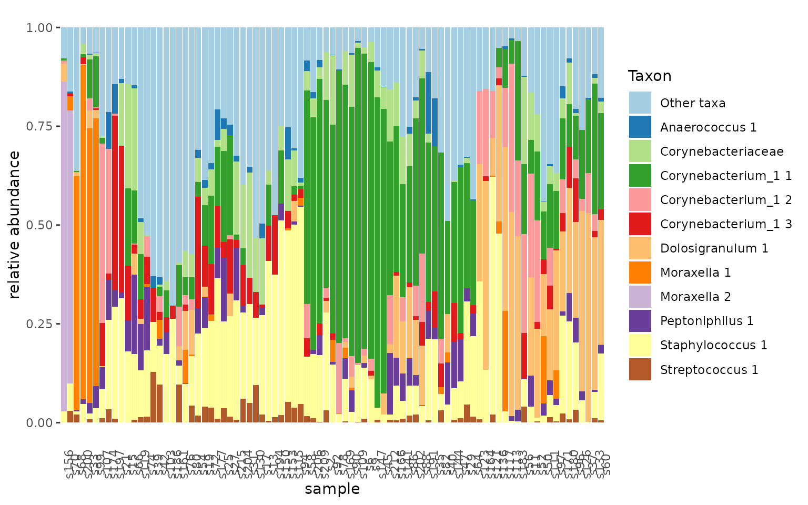
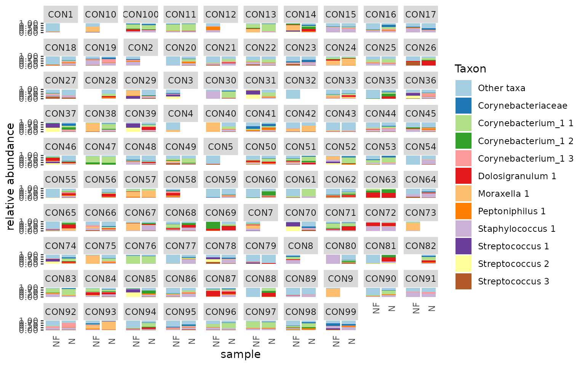
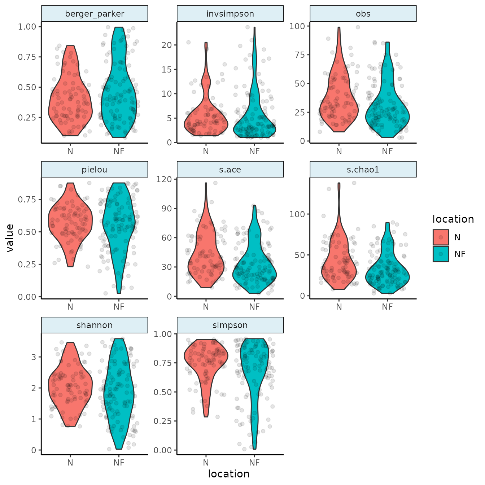

# Tidytacos quick start guide

This guide explains how to perform some common microbial sequencing
count data analysis tasks using tidytacos. We will illustrate those
using a dataset with human microbiome samples from the upper respiratory
tract (URT), taken from [this
paper](https://www.frontiersin.org/articles/10.3389/fmicb.2017.02372/full)
by De Boeck et al. It contains nose as well as nasopharynx samples. Most
samples were taken using a swab method, but a minority was taking with
the aspirate method.

## Philosophy of the package

A tidytacos object is simply a list of three tables:

- **counts**: These are the counts of reads for each taxon
  (OTU/ASV/phylotype) in each sample. Each row represents such a read
  count.
- **samples**: This table contains the sample metadata. Each row
  represents a sample.
- **taxa**: This table contains the taxonomy and other metadata for the
  taxa. Each row represents a taxon.

The package is called tidytacos because each of the tables is tidy:
every row represents an observation and every column a variable (more on
data tidying can be found at
<https://r4ds.hadley.nz/data-tidy.html#sec-tidy-data>). For this quick
start guide, we assume you are familiar with the tidyverse (especially
dplyr and ggplot).

The main differences with the popular phyloseq package are:

- The abundance table of tidytacos is in long format, while the
  otu_table object of phyloseq is in wide (matrix) format. A tidy read
  count table is more compact for very sparse data (such as microbiome
  data), and also easier to handle and visualize within the tidyverse
  framework.
- All tables in tidytacos are data frames (technically tibbles). In
  phyloseq, each table has its own special data type (i.e. the classes
  “otu_table”, “tax_table” and “sample_data”). This makes it sometimes
  difficult to access the data directly and do simple stuff with it.
  Also, the otu_table and tax_table classes are based on the matrix
  type, while the sample_data class is based on the dataframe type. This
  also makes data manipulation sometimes unstraightforward.
- In a phyloseq otu table, sometimes the rows are the taxa and sometimes
  the columns. This can easily lead to errors.

## Setting up

In case you haven’t installed tidytacos yet, it can be installed using
devtools:

``` r
install.packages("devtools")
devtools::install_github("LebeerLab/tidytacos")
```

For this guide, we only need to load two packages: tidytacos (of course)
and the tidyverse set of packages.

``` r
library(tidyverse)
#> ── Attaching core tidyverse packages ──────────────────────── tidyverse 2.0.0 ──
#> ✔ dplyr     1.1.4     ✔ readr     2.1.5
#> ✔ forcats   1.0.1     ✔ stringr   1.6.0
#> ✔ ggplot2   4.0.0     ✔ tibble    3.3.0
#> ✔ lubridate 1.9.4     ✔ tidyr     1.3.1
#> ✔ purrr     1.2.0     
#> ── Conflicts ────────────────────────────────────────── tidyverse_conflicts() ──
#> ✖ dplyr::filter() masks stats::filter()
#> ✖ dplyr::lag()    masks stats::lag()
#> ℹ Use the conflicted package (<http://conflicted.r-lib.org/>) to force all conflicts to become errors
library(tidytacos)
#> 
#> Attaching package: 'tidytacos'
#> 
#> The following object is masked from 'package:dplyr':
#> 
#>     everything
#> 
#> The following object is masked from 'package:tidyr':
#> 
#>     everything
```

The first step will usually be the conversion our data into a usable
tidytacos format. If, for example, you used DADA2 as explained
[here](http://rstudio-pubs-static.s3.amazonaws.com/273862_8258982fdfac49a8ba9d6ed651b9b539.md),
you can hand off the data to tidytacos using
[`from_dada()`](https://lebeerlab.github.io/tidytacos/reference/from_dada.md).
You can also convert a phyloseq object to a tidytacos object using the
[`from_phyloseq()`](https://lebeerlab.github.io/tidytacos/reference/from_phyloseq.md)

function. More options to import and convert your data can be found
[here](https://lebeerlab.github.io/tidytacos/reference/index.html#file-handling).

A tidytacos object is read and stored as three sparse tables (counts-,
taxa- and samples.csv). The sample table needs atleast a `sample_id`
column, the taxa table needs a `taxon_id` column with atleast one other
rank name column and the counts table needs a `sample_id`, `taxon_id`
and `counts` column. The taxa table of a default tidytacos object has
the domain, phylum, class, order, family, genus and species columns.
Species here has a special place as it is often ignored by some
functions unless specified, due to the low resolution of short read 16S
rRNA gene sequencing data.

To read in existing data from a folder called ‘my_data’ you would run:

``` r
my_path <- system.file("extdata", "tidytacos", "leaf", package = "tidytacos")
# my_path <- "local/path/my_data"
taco <- read_tidytacos(my_path)
```

Where you replace my_path with an actual path to your data. The path
used here uses data in our package.

To write your data to a folder called “my_data_filtered” you can run:

``` r
taco %>% write_tidytacos("my_data_filtered")
```

However, our example dataset is available in the tidytacos package and
doesn’t need to be imported or converted. It is called “urt” and we
start by inspecting the samples table:

``` r
glimpse(urt$samples)
#> Rows: 217
#> Columns: 9
#> $ run         <chr> "20161207_ilke_urt100", "20161207_ilke_urt100", "20161207_…
#> $ condition   <chr> "CON", "CON", "CON", "CON", "CON", "CON", "CON", "CON", "C…
#> $ participant <chr> "CON100", "CON100", "CON10", "CON10", "CON11", "CON11", "C…
#> $ location    <chr> "NF", "N", "NF", "NF", "NF", "N", "NF", "NF", "N", "NF", "…
#> $ method      <chr> "S", "S", "A", "S", "S", "S", "S", "S", "S", "S", "S", "S"…
#> $ plate       <dbl> 3, 3, 1, 1, 1, 1, 1, 1, 1, 1, 1, 1, 1, 1, 1, 1, 1, 1, 1, 1…
#> $ passes_qc   <lgl> TRUE, TRUE, TRUE, TRUE, TRUE, TRUE, TRUE, TRUE, TRUE, TRUE…
#> $ sample      <chr> "CON100-NF-S", "CON100-N-S", "CON10-NF-A", "CON10-NF-S", "…
#> $ sample_id   <chr> "s1", "s2", "s3", "s4", "s5", "s6", "s7", "s8", "s9", "s10…
```

We then have a quick look at the total number of samples, ASVs, and
reads in the tidytacos object:

``` r
tacosum(urt)
#> n_samples    n_taxa   n_reads 
#>       217      1957   3873478
```

## Making a stacked barplot of a subset of samples

We can very easily create a plot to explore a subset of our samples
(e.g., only nose samples taken with the swab method) in the following
way:

``` r
urt %>%
  filter_samples(location == "N", method == "S") %>%
  tacoplot_stack()
```



The `filter_samples` function does what it says: filtering samples. It
will also delete taxa from the taxa table that have zero total reads in
the remaining samples. The `tacoplot_stack` function returns a nice
stacked bar plot visualization of the most abundant taxa in our samples.

## Subsetting dataset

Our next question for this dataset is to what extent nose and
nasopharynx are linked from a microbiological point of view. To get an
idea we can first visualize this:

``` r
urt_s <- urt %>% filter_samples(method == "S")
tacoplot_stack(urt_s)+
  geom_point(aes(y=-0.02,color=location))
```


``` r
tacoplot_stack(urt_s, x = location) +
  facet_wrap(~ participant, nrow = 10)
#> Warning in tacoplot_stack(urt_s, x = location): Sample labels not unique,
#> samples are aggregated.
```



First, we make sure to include only swab samples. We can then visualize
the data in stacked bar plots. The tacoplot functions consist of ggplot
function calls and therefore geoms and other ggplot features can be
added.

## Alpha diversity

To explore alpha diversity, let’s create a rarefied version of the
dataset:

``` r
urt_rar <- urt %>%
  add_total_count() %>%
  filter_samples(total_count >= 2000) %>%
  rarefy(2000) %>%
  add_alphas()
```

We can visualize alpha diversities of nose versus the nasopharynx:

The `add_total_count` function will add total sample read numbers to the
sample table.

The `rarefy` function will randomly subsample all samples n times. It
only works if the read count of each sample equals or exceeds n. For
determining ASV richness, we chose to rarefy first, but this may depend
on your data.

The `add_alpha` function can be used to add several metrics of alpha
diversity to the sample table or in this cas we use the add_alphas to
add all the currently supported metrics.

Next we will plot the resulting alpha diversities and group per location
of sampling:

``` r
urt_rar %>%
  tacoplot_alphas(location)
#> Warning: Removed 4 rows containing non-finite outside the scale range
#> (`stat_ydensity()`).
#> Warning: Removed 4 rows containing missing values or values outside the scale range
#> (`geom_point()`).
```



The tacoplot_alphas function will use any alpha metric that has been
added by add_alpha(s) which it can find in the sample table.

## Principal coordinates analysis

We would like to address the differences between nose and nasopharynx.
We’re also more interested in genera than ASVs. A PCA might offer
insight:

``` r
urt_genus <- urt %>%
  filter_samples(method == "S") %>%
  aggregate_taxa(rank = "genus")

tacoplot_ord_ly(urt_genus,location, samplenames = sample, dim = 3)
#> Warning in remove_empty_samples(.): Removed 2 empty samples.
```

The `aggregate_taxa` function merges all rows of the taxa table together
at a specified taxonomic level, in this case the genus level. As for all
tidytacos functions, all other tables in the tidytacos object are
adjusted accordingly.

The `tacoplot_ord_ly` function will determine relative abundances of
taxa in the samples, and will then use Bray-Curtis dissimilarities to
ordinate samples in a 2-dimensional space based on their taxonomic
composition. The plotly “\_ly” addition makes the plot interactive,
which is really nice for exploratory work. This also works for other
plot functions.

## Relation between community composition and variables

A logical next question is to what extent the niche (nose versus
nasopharynx) determines the community composition variability. Let’s not
forget that everyone has their unique microbiome and include the
variable “participant” in the model.

``` r
perform_adonis(urt_genus, c("participant", "location"), by="margin")
#> Permutation test for adonis under reduced model
#> Marginal effects of terms
#> Permutation: free
#> Number of permutations: 999
#> 
#> adonis2(formula = as.formula(paste("counts_matrix", formula_RHS, sep = " ~ ")), data = metadata, permutations = permutations, by = "margin")
#>              Df SumOfSqs      R2       F Pr(>F)    
#> participant  97   31.076 0.64174  1.8848  0.001 ***
#> location      1    3.066 0.06331 18.0372  0.001 ***
#> Residual     81   13.768 0.28432                   
#> Total       179   48.424 1.00000                   
#> ---
#> Signif. codes:  0 '***' 0.001 '**' 0.01 '*' 0.05 '.' 0.1 ' ' 1
```

The `perform_adonis` function will perform a PERMutational ANOVA to
determine the effect of sample variables on the Bray-Curtis
dissimilarities of the communities. The result shows that participant is
a really important contributor to community composition (R squared =
0.65). Furthermore, there are consistent significant differences between
the communities of nose and nasopharynx (R squared = 0.06).

## Differential abundance analysis

Next, we would like to know which of the 20 most abundant genera, are
significantly more abundant in the nasopharynx compared to the nose.

``` r
urt_genus <- urt_genus %>% add_codifab(location, max_taxa = 40)
urt_genus$taxon_pairs <- filter(urt_genus$taxon_pairs, wilcox_p < 0.05)
tacoplot_codifab(urt_genus, NF_vs_N)
```


The `add_codifab` function will add a table called taxon_pairs to the
tidytacos object, with for each pair of a taxon and a reference taxon,
the differential abundance of the taxon between the two conditions (with
respect to the reference taxon).

The `codifab_plot` function returns a plot to visualize differential
abundance of taxa between conditions, compared to all other taxa as
references. We can observe that *Haemophilus* is most likely to be
typical for the Nasopharynx, whereas *Anaerococcus* is most likely to be
typical for the nose.

Of note, there are many differential abundance analysis methods out
there and none of them are perfect. Interpret your results with care.
