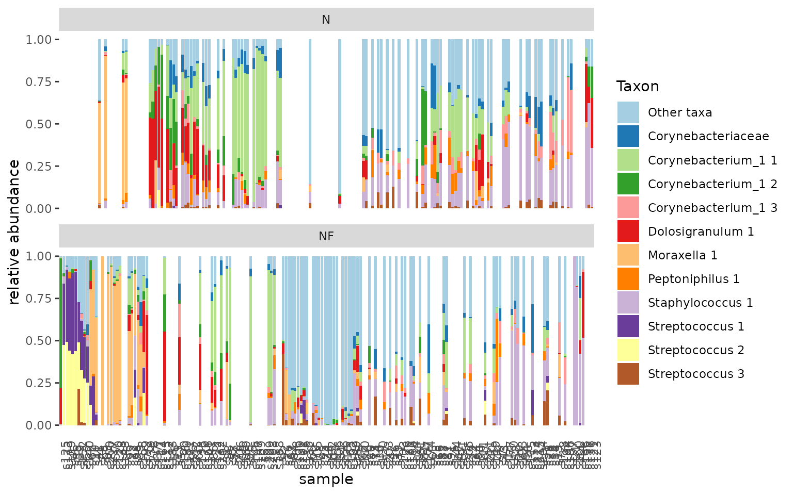
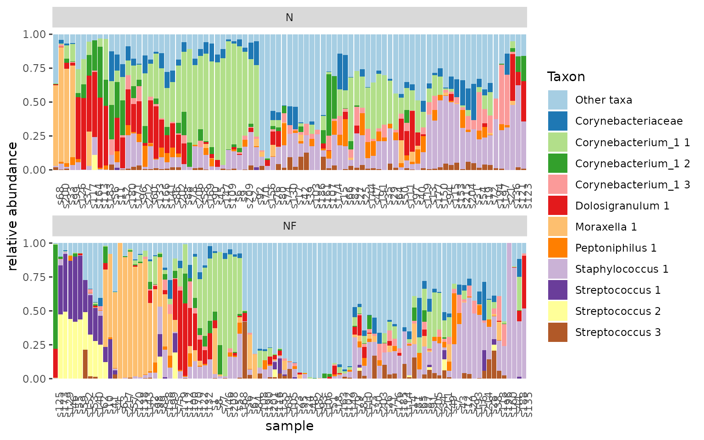
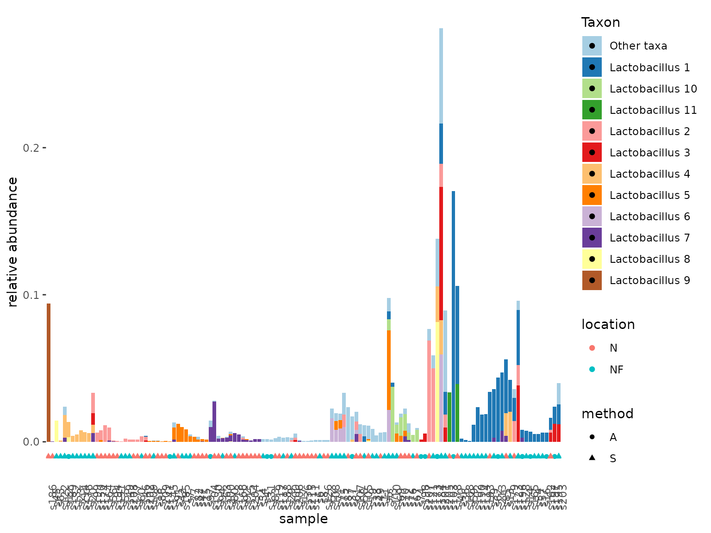

# Stacked Barplots

This vignette explains in more detail how to modify the stacked bar
plots of tidytacos. We will illustrate those using a dataset with human
microbiome samples from the upper respiratory tract (URT), taken from
[this
paper](https://www.frontiersin.org/articles/10.3389/fmicb.2017.02372/full)
by De Boeck et al. It contains nose as well as nasopharynx samples. Most
samples were taken using a swab method, but a minority was taking with
the aspirate method.

## Setting up

We need only two packages: tidytacos (of course) and the tidyverse set
of packages.

``` r
library(tidyverse)
#> ── Attaching core tidyverse packages ──────────────────────── tidyverse 2.0.0 ──
#> ✔ dplyr     1.1.4     ✔ readr     2.1.6
#> ✔ forcats   1.0.1     ✔ stringr   1.6.0
#> ✔ ggplot2   4.0.1     ✔ tibble    3.3.0
#> ✔ lubridate 1.9.4     ✔ tidyr     1.3.1
#> ✔ purrr     1.2.0     
#> ── Conflicts ────────────────────────────────────────── tidyverse_conflicts() ──
#> ✖ dplyr::filter() masks stats::filter()
#> ✖ dplyr::lag()    masks stats::lag()
#> ℹ Use the conflicted package (<http://conflicted.r-lib.org/>) to force all conflicts to become errors
library(tidytacos)
#> 
#> Attaching package: 'tidytacos'
#> 
#> The following object is masked from 'package:dplyr':
#> 
#>     everything
#> 
#> The following object is masked from 'package:tidyr':
#> 
#>     everything
```

## Making a stacked barplot of a subset of samples

We start by selecting the samples we are interesting in: only the ones
from the nose, taken with the swab method.

``` r
urt_ns <- urt %>%
  filter_samples(location == "N", method == "S")
```

We can very easily create explorative plots of our samples in the
following ways:

``` r
tacoplot_stack(urt_ns)
```


``` r
tacoplot_stack_ly(urt_ns, x=sample)
```

The `tacoplot_stack` function returns a nice bar plot visualization of
the most abundant taxa in our samples. The `tacoplot_stack_ly` function
returns an interactive version of the same bar plot. The order of the
samples on the x-axis is determined by hierarchical clustering of the
visualized sample composition. In addition, these functions do some
things behind the screens:

- Add relative abundances to the counts table.
- For each taxon, calculate the mean relative abundance across all
  samples where this taxon occurs.
- Give all taxa a human-understandable name so that the taxon name is
  unique. This is just the genus name of the taxon, followed by a number
  to make it unique. Taxa with a higher mean relative abundance get a
  smaller number. E.g. “Lactobacillus 1” is the Lactobacillus taxon with
  the largest mean relative abundance.
- Make a new variable that is equal to the taxon name, except that only
  the top-11 taxa retain their name and all others are changed to “Other
  taxa”. This is for visualization purposes; the human eye can only
  discriminate clearly between about 12 colors.

All these new variables are created under the hood, but are gone when
the function execution is finished (there are no so-called
“side-effects”). Luckily, for each of these variables there also exists
a function that will create it and keep it! These functions are the
following (there names are intended to be self-explanatory as much as
possible):

- `add_rel_abundance`: adds to counts table
- `add_mean_rel_abundance`: adds to taxa table
- `add_taxon_name`: adds to taxa table
- `add_taxon_name_color`: adds to taxa table

There are more of such functions that add an extra variable to one of
the tables; we will explore them further in other parts of this
vignette.

## Making a facet wrapped stacked barplot

There are two interesting types of facet wrapped bar plots we can make:
facets with fixed x-axis categories, and facets without fixed x-axis
categories.

**Facets with fixed x-axis categories**

The first type is a plot where the variable on the x-axis is not the
sample name (the not-very-informative default). We want the categories
of that variable in the same order in all our subplots. For example, we
have a subplot for every participant, and for each participant we want
to see the nose sample and the nasopharynx sample, in that order. This
is achieved by adding a `x = location` extra argument to the barplot
function, and adding a
[`facet_wrap()`](https://ggplot2.tidyverse.org/reference/facet_wrap.html)
layer. Putting the x-axis categories in the same order in all subplots
is the default behaviour of the
[`facet_wrap()`](https://ggplot2.tidyverse.org/reference/facet_wrap.html)
function. Note that the order of the samples in each subplot is now
determined by the categories of the variable we put there
(e.g. alphabetically sorted), and no longer by a sample clustering
procedure!

``` r
urt_s <- urt%>%
  filter_samples(method == "S")

tacoplot_stack(urt_s, x = location) +
  facet_wrap(~ participant, nrow = 10)
#> Warning in tacoplot_stack(urt_s, x = location): Sample labels not unique,
#> samples are aggregated.
```


**Facets without fixed x-axis categories**

The second type of facet wrapped plot is one where we have the sample
names on the x-axis, as usual, and they are sorted according to a
clustering procedure. For example, we want one facet per sampling
location, with only the samples belonging to that location. This can be
achieved in the following way:

``` r
tacoplot_stack(urt_s) +
  facet_wrap(~ location, nrow = 2)
```



This is not quite right. The default behavior of
[`facet_wrap()`](https://ggplot2.tidyverse.org/reference/facet_wrap.html)
is to repeat all possible x-axis values in all facets, even if there is
no information there! In our case, the default behaviour would be to put
all samples names in the nose facet and nasopharynx facet, and plot
empty space if a sample name - sampling location combination doesn’t
exist. Adding the argument `scales = "free_x"` corrects this behavior
and also makes sure that the samples are plotted in order of clustering:

``` r
tacoplot_stack(urt_s) +
  facet_wrap(~ location, scales = "free_x", nrow = 2)
```



## Plotting only a subset of taxa, without “Other taxa”

To be able to do this, we need to do a number of things by hand that
normally happen “under the hood” in the
[`tacoplot_stack()`](https://lebeerlab.github.io/tidytacos/reference/tacoplot_stack.md)
function:

- Step 1: We add relative abundances. We want them to be calculated with
  respect to the full samples, before the taxa we’re not interested in
  are removed!
- Step 2: We select only the taxa we want (e.g. family
  Lactobacillaceae).
- Step 3: We add the variable “taxon_name_color”; this variable is equal
  to “taxon_name”, except that everything apart from the n most abundant
  taxa (which are at this moment all Lactobacillaceae!) will be called
  “Other taxa”.
- Step 4: We make the plot.

Thanks to the `%>%` (pipe) operator from the magrittr package, we can
achieve all this using the following elegant code:

``` r
urt %>%
  add_rel_abundance() %>%
  filter_taxa(family == "Lactobacillaceae") %>%
  add_taxon_name_color() %>%
  tacoplot_stack()+
    geom_point(aes(y=-0.01,color=location,shape=method))
```


