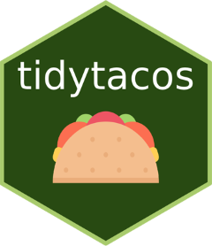

# Summary

The `tidytacos` (tidy TAxonomic COmpositionS) package is an R package for the exploration of microbial community data. Such community data consists of read counts generated by amplicon sequencing (e.g. a region of the 16S rRNA gene) or metagenome (shotgun) sequencing. `tidytacos` is based on the tidy principle introduced by Hadley Wickham where the data are stored in a consistent format [@wickham2023r]. Specifically, `tidytacos` uses the tidy format and grammar to select, transform, and prepare microbial community data for visualization and analyses. In addition, it offers a range of functions for popular and less known analyses and visualizations of microbial community data. `tidytacos` is designed for researchers across various levels of expertise, to offer both an improved accessibility to microbial community data and to allow easy transformation of data for novel approaches of visualization and analysis.  

# Statement of need

In the past two decades, DNA sequencing for the determination of microbial community composition has emerged as a powerful and transformative tool in the field of microbiology. Advancements in sequencing technologies have made it possible to explore and understand the vast diversity of microbial communities present in various environments (including the human microbiome) with unprecedented accuracy and depth at increasingly lower costs. This has led to more and more researchers, many with no prior experience in this field, attempting to determine the microbial community composition of samples using amplicon and metagenome sequencing technologies. Unsurprisingly, there is a high need for accessible tools both to process raw sequencing reads to taxonomically annotated read counts and subsequently interpret these taxonomic compositions. Researchers having to handle this kind of data for the first time often struggle with the gathering, transformation, and preparation of data for visualisation and analyses, which is a crucial step in the data analysis process. These steps lay the foundation of accurate and reliable insights.
`tidytacos` is a toolkit for data wrangling of DNA-sequencing-based microbial community data. It increases accessibility of microbial community data, but also allows researchers who are more experienced with this type of data to address novel questions. The tool includes a range of simple functions for common exploratory analyses, visualizations, and statistical analyses. `tidytacos` offers similar functionalities as packages such as microViz [@barnett2021microviz], mia [@ernst1mia], and phyloseq [@mcmurdie2013phyloseq], but was designed specifically to be very accessible to researchers with limited R and general programming experience. To achieve this, tidytacos was embedded in the tidyverse framework, which provides a style of programming that is very intuitive for new (but also experienced) programmers and is often the starting point for many people learning R. Tidytacos is also very easy to install, since it has only the main tidyverse packages as dependencies for the vast majority of its functionality. Finally, tidytacos also serves the needs of researchers who are looking to implement some rarely used or new visualizations and methods of analysis. `tidytacos` has already been used in a number of scientific publications by different researchers [@smets2023leaf; @smets2022bacterial; @legein2022greenhouse; @de2017comparing; @oerlemans2020impact; @de2019anterior; @oerlemans2022impacts; @jorissen2021case; @lebeer2022selective; @de2022randomized; @allonsius2019microbiome; @de2020lactobacilli; @spacova2022spontaneous; @ahannach2021microbial; @de2021nasal; @papini2023boosting; @peng2020return; @van2021piloting; @van2021oxygen; @lebeer2023citizen] and has also been used by several undergraduate, graduate, and PhD students during their research projects [@van2022resource; @legein2022phyllosphere], demonstrating its versatility in topics and user experience.   

# Functionality

`tidytacos` is a package for R, which is the most widely used programming language for microbial community analyses. It adheres to the tidy principles of coding and of structuring data and builds on the tidyverse collection of packages [@wickham2019welcome]. The package stores microbial community data in one “tidytacos object” which is a list of three tables: 
1)	The counts: these are the counts of reads for each taxon (OTU/ASV/phylotype) in each sample. Each row contains exactly one read count, representing a single observation. This is the typical long format in the tidyverse. 
2)	The samples: this table contains the sample metadata. Each row represents a sample. 
3)	The taxa: this table contains the taxonomy and other metadata for the taxa. Each row represents a taxon. 
The package is called `tidytacos` because each of the tables is tidy: each row represents an observation and each column a variable. Additionally, it adopts the grammar for data manipulation introduced by the `dplyr` package of the tidyverse, allowing, for example, the filtering and selection of samples and taxa and their associated information (e.g. filter_samples, filter_taxa, select_samples, select_taxa). Also, aggregating samples or taxa (aggregate_samples, aggregate_taxa) and conversion of the taxon counts (add_rel_abundance/add_clr_abundance) are supported, including a function to determine absolute abundances (add_absolute_abundance) based on the spike-in method [@smets2016method; @wang2021current]. There are quick functions for visualizing community composition of samples using stacked bar plots (tacoplot_stack) or visualizing a two-dimensional ordination of samples (tacoplot_ord) based on the ggplot2 package of the tidyverse. Additionally, functions to study the effect of sample variables on community variation are available (e.g. perform_adonis) and differentially abundant taxa can be determined with a method based on the logratio differences introduced by @aitchison1982statistical. The full overview of functions, code, a quick start tutorial, and more advanced tutorials are available on the [Github](https://github.com/LebeerLab/tidytacos) page, https://github.com/LebeerLab/tidytacos.

# Acknowledgements

We would like to acknowledge the work of the R-core team who maintain the R language and the contributors of the tidyverse. We also want to thank other members and alumni of the Lebeer Lab who contributed code and/or documentation: Wannes Van Beeck, Sander Wuyts, and Tom Eilers. We furthermore acknowledge the financial support of the FWO (fellowship 11A0620N of SW and fellowship 12ZJ821N of WS) and ERC (starting grant Lacto-Be, 852600, of SL).

# References

